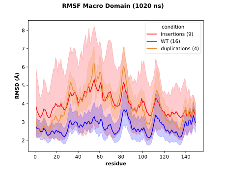

# RMSF by condition comparison

Aggregate the RMSF results in one plot regrouping the samples by conditions.

The RMSF computation for each sample must have been performed with the `rms.py` script available in the 
[RMS repository](https://github.com/njeanne/rms).

The input file is a CSV (comma separated with a header) which columns described respectively the condition, the path 
to the directory for the condition and the color in hexadecimal format for the condition. 

For each condition of the CSV file, the script will search for the RMSF CSV files and aggregate them by condition and 
plot the mean and 95% confidence interval.

## Conda environment

A [conda](https://docs.conda.io/projects/conda/en/latest/index.html) YAML environment file is provided: 
`conda_env/rmsf_compare_env.yml`. The file contains all the dependencies to run the script.

The conda environment is created using the command:
```shell script
# create the environment
conda env create -f conda_env/rmsf_compare_env.yml

# activate the environment
conda activate rmsf_compare
```

The usage of the script after activating the conda environment can be displayed with:
```shell script
./rmsf_compare.py -h
```

## Usage

The script can be tested with the data in the `test` directory, choosing the median method to aggregate the data:
```shell script
conda activate rmsf_compare

DOMAIN="Macro Domain"
DOMAIN_WITHOUT_SPACES="${DOMAIN// /-}"

./rmsf_compare.py --out results --annotations inputs/annotations --domain "$DOMAIN" --md-time 1020 \
--log results/$DOMAIN_WITHOUT_SPACES"_rmsf_compare.log" inputs/inputs_conditions.csv

conda deactivate
```

## Inputs

The input conditions file, `inputs/inputs_conditions.csv`:

|condition   |RMSF files directory    |color  |
|------------|------------------------|-------|
|insertions  |inputs/RMSF/insertions  |#fc030b|
|duplications|inputs/RMSF/duplications|#eb8c34|
|WT          |inputs/RMSF/WT          |#0303fc|

`--annotations`: the annotations CSV files directory.

The annotation CSV (comma separated) file format is:

|domain               |start|end |
|---------------------|-----|----|
|Putative Capping Pore|9    |459 |
|Metal Binding Domain |516  |689 |
|HVR                  |714  |801 |
|Macro Domain         |802  |950 |
|Helicase             |953  |1232|
|RdRp                 |1251 |1709|


`--domain`: the domain to search in the annotation file.

`--md-time`: the molecular dynamics time in nanoseconds.


## Outputs

- a CSV file of the samples RMSF data updated: `Macro-Domain_samples_domain_sizes.csv`:

|sample                     |start|end|length|condition   |path_rmsf                                                           |color  |rejected|
|---------------------------|-----|---|------|------------|--------------------------------------------------------------------|-------|--------|
|HEPAC-12-3_duplication_ORF1|1    |450|449   |duplications|inputs/RMSF/duplications/RMSF_HEPAC-12-3_duplication_ORF1_0_ORF1.csv|#eb8c34|True    |
|HEPAC-12-1_duplication_ORF1|1    |450|449   |duplications|inputs/RMSF/duplications/RMSF_HEPAC-12-1_duplication_ORF1_0_ORF1.csv|#eb8c34|True    |
|HEPAC-12-2_duplication_ORF1|1    |450|449   |duplications|inputs/RMSF/duplications/RMSF_HEPAC-12-2_duplication_ORF1_0_ORF1.csv|#eb8c34|True    |
|HEPAC-154_KIF1B_ORF1       |9    |459|450   |insertions  |inputs/RMSF/insertions/RMSF_HEPAC-154_KIF1B_ORF1_0_ORF1.csv         |#fc030b|False   |
|HEPAC-6_RNF19A_ORF1        |9    |459|450   |insertions  |inputs/RMSF/insertions/RMSF_HEPAC-6_RNF19A_ORF1_0_ORF1.csv          |#fc030b|False   |
|KY232312-3f_WT_ORF1        |9    |459|450   |WT          |inputs/RMSF/WT/RMSF_KY232312-3f_WT_ORF1_0_ORF1.csv                  |#0303fc|False   |
|KU980235-3f_WT_ORF1        |9    |459|450   |WT          |inputs/RMSF/WT/RMSF_KU980235-3f_WT_ORF1_0_ORF1.csv                  |#0303fc|False   |
|HEPAC-26_RPL6_ORF1         |9    |459|450   |insertions  |inputs/RMSF/insertions/RMSF_HEPAC-26_RPL6_ORF1_0_ORF1.csv           |#fc030b|False   |
|HEPAC-93_RNA18SP5_ORF1     |9    |459|450   |insertions  |inputs/RMSF/insertions/RMSF_HEPAC-93_RNA18SP5_ORF1_0_ORF1.csv       |#fc030b|False   |
|HEPAC-100_PEBP1_ORF1       |9    |459|450   |insertions  |inputs/RMSF/insertions/RMSF_HEPAC-100_PEBP1_ORF1_0_ORF1.csv         |#fc030b|False   |
|KY780957-3chi_WT_ORF1      |9    |459|450   |WT          |inputs/RMSF/WT/RMSF_KY780957-3chi_WT_ORF1_0_ORF1.csv                |#0303fc|False   |
|HEPAC-95_duplication_ORF1  |9    |459|450   |duplications|inputs/RMSF/duplications/RMSF_HEPAC-95_duplication_ORF1_0_ORF1.csv  |#eb8c34|False   |
|MG783569-3_WT_ORF1         |9    |459|450   |WT          |inputs/RMSF/WT/RMSF_MG783569-3_WT_ORF1_0_ORF1.csv                   |#0303fc|False   |
|JQ679013_RPS17_ORF1        |9    |459|450   |insertions  |inputs/RMSF/insertions/RMSF_JQ679013_RPS17_ORF1_0_ORF1.csv          |#fc030b|False   |
|AB291961-3f_WT_ORF1        |9    |459|450   |WT          |inputs/RMSF/WT/RMSF_AB291961-3f_WT_ORF1_0_ORF1.csv                  |#0303fc|False   |
|AB437318-3b_WT_ORF1        |9    |459|450   |WT          |inputs/RMSF/WT/RMSF_AB437318-3b_WT_ORF1_0_ORF1.csv                  |#0303fc|False   |
|HEPAC-64_ZNF787_ORF1       |9    |459|450   |insertions  |inputs/RMSF/insertions/RMSF_HEPAC-64_ZNF787_ORF1_0_ORF1.csv         |#fc030b|False   |
|KT447527-3efg_WT_ORF1      |9    |459|450   |WT          |inputs/RMSF/WT/RMSF_KT447527-3efg_WT_ORF1_0_ORF1.csv                |#0303fc|False   |
|AB248520-3e_WT_ORF1        |9    |459|450   |WT          |inputs/RMSF/WT/RMSF_AB248520-3e_WT_ORF1_0_ORF1.csv                  |#0303fc|False   |
|JN837481-3a_WT_ORF1        |9    |459|450   |WT          |inputs/RMSF/WT/RMSF_JN837481-3a_WT_ORF1_0_ORF1.csv                  |#0303fc|False   |
|JQ679014_WT_ORF1           |9    |459|450   |WT          |inputs/RMSF/WT/RMSF_JQ679014_WT_ORF1_0_ORF1.csv                     |#0303fc|False   |
|MF444031-3c_WT_ORF1        |9    |459|450   |WT          |inputs/RMSF/WT/RMSF_MF444031-3c_WT_ORF1_0_ORF1.csv                  |#0303fc|False   |
|FJ956757-3f_WT_ORF1        |9    |459|450   |WT          |inputs/RMSF/WT/RMSF_FJ956757-3f_WT_ORF1_0_ORF1.csv                  |#0303fc|False   |
|KT447528-3a_WT_ORF1        |9    |459|450   |WT          |inputs/RMSF/WT/RMSF_KT447528-3a_WT_ORF1_0_ORF1.csv                  |#0303fc|False   |
|JN906974-3f_WT_ORF1        |9    |459|450   |WT          |inputs/RMSF/WT/RMSF_JN906974-3f_WT_ORF1_0_ORF1.csv                  |#0303fc|False   |
|FJ653660-3f_WT_ORF1        |9    |459|450   |WT          |inputs/RMSF/WT/RMSF_FJ653660-3f_WT_ORF1_0_ORF1.csv                  |#0303fc|False   |
|HEPAC-100_GATM_ORF1        |9    |459|450   |insertions  |inputs/RMSF/insertions/RMSF_HEPAC-100_GATM_ORF1_0_ORF1.csv          |#fc030b|False   |
|EU495148-3f_WT_ORF1        |9    |459|450   |WT          |inputs/RMSF/WT/RMSF_EU495148-3f_WT_ORF1_0_ORF1.csv                  |#0303fc|False   |
|HEPAC-93_EEF1A1_ORF1       |9    |459|450   |insertions  |inputs/RMSF/insertions/RMSF_HEPAC-93_EEF1A1_ORF1_0_ORF1.csv         |#fc030b|False   |


- the RMSF means and 95% confidence interval by condition: `Macro-Domain_1020-ns_RMSF.svg`



